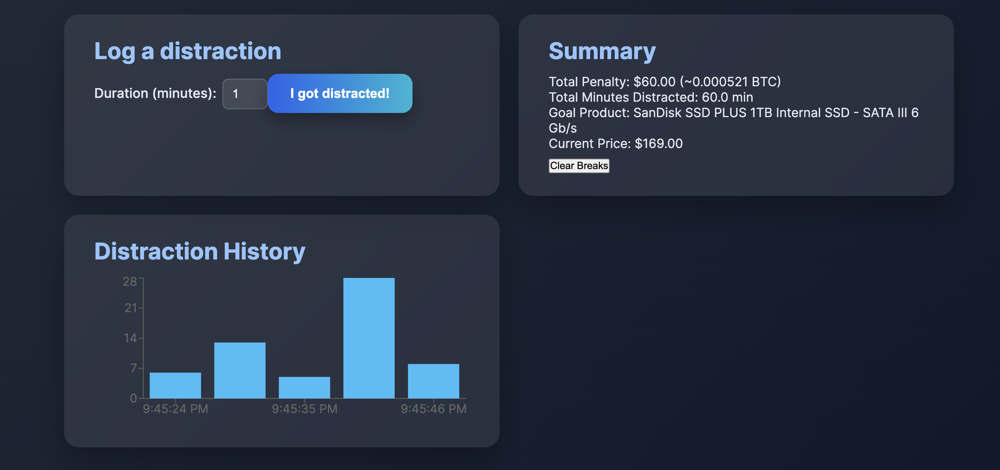

# FocusPrice

## Problem Statement
Oftentimes, when I'm trying to study or get work done, I get distracted by my phone and end up scrolling when I shouldn't be. Even if they're just small breaks, they add up and also disrupt the flow state you get into when working. I wanted to design something that could fix this by keeping me more accountable and allow me to track my progress throughout time. This is mainly done by displaying something I want and how getting distracted by my phone is causing this item to slip through my fingertips because I am unable to stay focused and work hard.

## Solution
My website allows you to pick an item from the FakeStore API that you want (I originally wanted to use the Best Buy API, but they don't allow .edu accounts). Whenever you get distracted and take a break, you self report the amount of time as well as how costly you would like the break to be. This is then added to the price of your item and you watch as it increases in price, punishing you for wasting your time. USD is converted to BTC by calling the CoinGecko API which fetches live BTC price. I implemented this as a way for the penalty tax to seem more "real" because I felt like just seeing USD on the screen might be easy to disregard.  

## API Used
- **CoinGecko simple price API**
  - **Docs**: https://www.coingecko.com/en/api/documentation
  - **How it's used**: We fetch `bitcoin` price in USD to convert penalties from USD -> BTC.
- **Fake Store API**
  - **Docs**: https://fakestoreapi.com/
  - **How it's used**: We fetch product list and product details to let the user choose a target product.

## Features
- Select a product to save for (Fake Store API).
- Log breaks (minutes) and compute penalty in USD.
- Convert penalty to BTC using CoinGecko and display both.
- Show total penalties and inflated product price.
- Loading states and basic error handling for API calls.
- Small local break history persisted in `localStorage`.

## Setup Instructions
1. Clone this repository.
2. Run `npm install`.
3. Run `npm run dev`.
4. Open the URL printed by Vite (usually `http://localhost:5174`).

> No API keys required — both APIs are public.

## AI Assistance
I used ChatGPT and Claude to help:
    Drafting the architecture of the program once I had my idea: I learned the difference between .js and .jsx and the reasoning behind using one or the other for certain files
    Write the code for the project: I learned some of the syntax for Javascript and was also able to see some similarities between Javascript and Python.
    Write the CSS to style the website: This was very helpful because it brought my website from a blank plaintext looking notepad to a minimal and more immersive experience.

## Screenshots

## Future Improvements
- Use an API from a real retailer such as Best Buy or Amazon
- Add more of a gamification system so that users might be inclined to keep using the software
- Add an account aspect so users can see more in depth statistics over time by data being saved (think github commit heatmap)
- Switch from self reporting breaks to another form (maybe have browser detect AFK or lack of activity)
